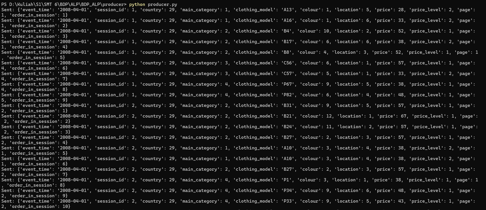

# Clickstream Analytics Pipeline for Online Fashion Shopping
**Kelompok 2:**<br>
Amanda Michelle Darwis - 07060223100..<br>
Evelin Alim Natadjaja - 0706022310021<br>
Evelyn Komalasari H - 07060223100..<br>
Felicia Kathrin V. H - 07060223100..<br>
Heidy Mudita Sutedjo - 0706022310044<br>
Sherin Alvinia Yonatan - 0706022310013

 ## Table of Contents
 1. [Overview](#-overview)
 2. [Problem Statement](#-problem-statement)
 3. [Dataset](#-dataset)
 4. [Architecture](#-architecture)
 5. [Tech Stack](#-tech-stack)
 6. [Project Structure](#-project-structure)
 7. [Prerequisites](#-prerequisites)
 8. [How to Run](#-how-to-run)
 9. [Services & Ports](#-services--ports)
 10. [Pipeline Explanation](#-pipeline-explanation)
 11. [Dashboard](#-dashboard)

---
 ## Overview

Project ini membangun sebuah **end-to-end big data pipeline** yang mampu memproses data clickstream dari sebuah toko pakaian online secara **real-time (streaming)** maupun **batch**. Pipeline ini mensimulasikan alur kerja nyata di industri e-commerce, mulai dari pengiriman event klik pengguna, pemrosesan skala besar, hingga visualisasi insight di dashboard interaktif.

**Apa itu clickstream?**  
Setiap kali seseorang membuka halaman produk, mengklik item, atau berpindah halaman di sebuah toko online, aktivitas tersebut dicatat sebagai sebuah "event". Kumpulan event inilah yang disebut **clickstream data**. Dengan menganalisisnya, kita bisa memahami perilaku belanja, produk populer, hingga pola navigasi pengguna.

---
## Problem Statement

Toko fashion online menghasilkan ribuan event klik setiap harinya. Tantangan utamanya:

- **Bagaimana memproses data volume besar secara efisien?** Data clickstream bisa mencapai ribuan baris per hari.
- **Bagaimana mendapatkan insight secara real-time?** Bisnis perlu tahu produk mana yang sedang tren *saat ini*, bukan kemarin.
- **Bagaimana menggabungkan analisis historis dan live?** Keputusan bisnis membutuhkan konteks dari masa lalu dan kondisi terkini.

Project ini menjawab ketiga tantangan tersebut dengan membangun pipeline yang memisahkan jalur **streaming** (untuk analisis real-time) dan **batch** (untuk analisis historis).

---
 ## Project Description

Proyek ini mengimplementasikan pipeline analitik clickstream secara real-time dan batch untuk toko pakaian online untuk wanita hamil asal Polandia yang memiliki lebih dari 165.000 data. Setiap kali pengguna mengklik atau membuka halaman produk, aktivitas tersebut dicatat dan dikirim ke sistem untuk dianalisis secara langsung maupun secara keseluruhan.

Sistem ini menggunakan Apache Kafka untuk mengalirkan data, Apache Spark untuk memprosesnya, dan Streamlit untuk menampilkan hasilnya dalam bentuk grafik dan tabel yang mudah dipahami. Semua komponen dijalankan sekaligus hanya dalam satu perintah menggunakan Docker Compose.

---
## Dataset

**Sumber:** [Clickstream Data for Online Shopping – Kaggle](https://www.kaggle.com/datasets/tunguz/clickstream-data-for-online-shopping)

**File:** `data/e-shop-clothing-2008.csv`

Dataset ini berisi data clickstream dari sebuah toko pakaian online untuk wanita hamil di Polandia selama tahun 2008, dengan sekitar **165.000+ baris** data. Dataset ini mengambil data 5 bulan di 2008 untuk mengetahui dan membandingkan perilaku belanja (konsumsi) di Polandia dan negara sekitar di Eropa.

### Schema Dataset

| Kolom | Tipe | Deskripsi |
|---|---|---|
| `year` | integer | Tahun event |
| `month` | integer | Bulan event |
| `day` | integer | Hari event |
| `order` | integer | Urutan klik dalam satu sesi |
| `country` | integer | Kode negara pengunjung |
| `session ID` | integer | ID unik sesi belanja |
| `page 1 (main category)` | integer | Kategori utama pakaian yang dikunjungi |
| `page 2 (clothing model)` | string | Kode model pakaian spesifik |
| `colour` | integer | Kode warna pakaian |
| `location` | integer | Lokasi produk di halaman |
| `model photography` | integer | Tipe foto produk |
| `price` | integer | Harga produk |
| `price 2` | integer | Level/kategori harga |
| `page` | integer | Nomor halaman yang dikunjungi |


---
### Event Schema (Kafka)

Setelah diproses oleh producer, setiap baris CSV dikirim ke Kafka dalam format JSON:

```json
{
  "event_time": "2008-04-01",
  "session_id": 1,
  "country": 29,
  "main_category": 1,
  "clothing_model": "A13",
  "colour": 1,
  "location": 5,
  "price": 28,
  "price_level": 2,
  "page": 1,
  "order_in_session": 1
}
```

| Kolom | Tipe | Deskripsi |
|---|---|---|
| `event_time` | string | tanggal kegiatan |
| `session_id` | integer | ID unik sesi belanja |
| `country` | integer | Kode negara pengunjung |
| `main_category` | integer | kategori pakaian utama |
| `clothing_model` | string | Kode model pakaian |
| `colour` | integer | kode warna pakaian |
| `location` | integer | Lokasi produk di halaman |
| `price` | integer | Harga produk |
| `price_level` | integer | Kategori harga |
| `page` | integer | Nomor halaman yang dikunjungi |
| `order_in_session` | integer | Urutan klik dalam sesi |

---
## Architecture


### Alur Data (Data Flow)

1. **CSV → Producer:** `producer.py` membaca file CSV baris per baris dan mengirimkannya sebagai JSON event ke Kafka secara streaming.
2. **Kafka:** Bertindak sebagai message broker terpusat. Menyimpan event di topic `clickstream-fashion-events` dengan 3 partisi agar bisa diproses paralel.
3. **Spark Streaming:** Dua Spark job secara bersamaan mengkonsumsi data dari Kafka:
   - `streaming_raw.py` — menyerap data mentah dan memvalidasi skema
   - `streaming_aggregation.py` — melakukan agregasi real-time (hitungan per kategori, per negara, dll.)
4. **Spark Batch:** `batch_analysis.py` memproses keseluruhan dataset CSV untuk insight historis mendalam.
5. **Dashboard:** Streamlit membaca output dari Spark (disimpan di `dashboard_data/`) dan menampilkannya sebagai grafik dan tabel interaktif.


## Tech Stack

| Tech | Versi | Fungsi |
|---|---|---|
| **Apache Kafka** | 4.2.0 (KRaft) | Message streaming broker |
| **Apache Spark** | 4.0.0 | Distributed data processing |
| **PySpark** | 4.0.0 | Python API untuk Spark |
| **Streamlit** | latest | Interactive dashboard |
| **Docker & Docker Compose** | latest | Container orchestration |
| **Python** | 3.x | Bahasa pemrograman utama |
| **Kafka UI** | latest | Visual monitoring Kafka |
| **Jupyter Notebook** | PySpark | Data exploration |
| **Strimzi Kafka Bridge** | 0.33.1 | REST API untuk Kafka |

## Project Structure

```
project/
├── docker-compose.yml          # Definisi semua services (Kafka, Spark, Streamlit, dll)
├── README.md                   # Dokumentasi ini
│
├── config/                     # Konfigurasi Kafka (server.properties, env, bridge)
│
├── data/
│   └── e-shop-clothing-2008.csv   # Dataset clickstream utama
│
├── producer/
│   ├── producer.py             # Membaca CSV & mengirim event ke Kafka
│   └── requirements.txt        # Dependencies: kafka-python, pandas
│
├── jobs/
│   ├── streaming_raw.py        # Spark: konsumsi raw data dari Kafka
│   ├── streaming_aggregation.py # Spark: agregasi real-time dari Kafka
│   └── batch_analysis.py       # Spark: analisis batch dari CSV
│
├── dashboard/
│   ├── app.py                  # Aplikasi Streamlit (dashboard visualisasi)
│   ├── Dockerfile              # Container image untuk Streamlit
│   └── requirements.txt        # Dependencies Streamlit
│
├── checkpoints/                # Spark Structured Streaming checkpoints (fault-tolerance)
├── dashboard_data/             # Output Spark → dibaca oleh Streamlit
└── assets/
    └── architecture.png        # Gambar arsitektur pipeline
```

**Penjelasan folder penting:**
- `producer/` — "pintu masuk" data. Semua kode pengiriman event ada di sini.
- `jobs/` — "otak" pipeline. Semua logika pemrosesan Spark ada di sini.
- `dashboard/` — "wajah" pipeline. Semua kode visualisasi ada di sini.
- `checkpoints/` — folder otomatis diisi Spark untuk menyimpan progress streaming. Jangan dihapus saat job berjalan!
- `dashboard_data/` — "jembatan" antara Spark dan Streamlit. Spark menulis ke sini, Streamlit membaca dari sini.

---
## Prerequisites

Pastikan sudah terinstall:

- [Docker Desktop](https://www.docker.com/products/docker-desktop/) (versi terbaru)
- [Docker Compose](https://docs.docker.com/compose/install/) (sudah termasuk di Docker Desktop)
- Python 3.8+ (untuk menjalankan producer & jobs di luar container, opsional)


---


# Step by Step Guideline

## Step 1 — Clone Repository & Masuk ke Folder

Lakukan clone Github di VSCode dan berada di root folder project:

```bash
git clone https://github.com/EvelynnnKH/BDP_ALP.git
cd BDP_ALP
```

Pastikan sudah membuka aplikasi Docker Desktop dan jalankan semua Docker services menggunakan Docker Compose:

```bash
docker compose up
```

(Warning) Jika sudah ada folder yang tersedia atau terdapat error pada saat build atau:

```bash
docker compose down
docker compose up --build
```

> Tunggu beberapa waktu hingga semua container berjalan. Anda bisa memantau status di terminal.

Jika semua container telah dijalankan, buka terminal baru, lalu jalankan:
```bash
docker compose ps
```
Expected Containers:
## Service Architecture

| Component | Technology | Container | Access URL |
|------------|------------|------------|------------|
| Message Broker | Apache Kafka | `alp-kafka` | `localhost:9092` |
| Kafka Management UI | Kafka UI | `alp-kafka-ui` | `http://localhost:8080` |
| Cluster Manager | Apache Spark Master | `alp-spark-master` | `http://localhost:8082` |
| Processing Node | Apache Spark Worker | `alp-spark-worker` | `http://localhost:8083` |
| Data Analytics Notebook | Jupyter PySpark | `jupyter` | `http://localhost:8888` |
| Streaming Dashboard | Streamlit | `alp-streamlit` | `http://localhost:8501` |
| REST Gateway | Strimzi Kafka Bridge | `alp-strimzi-bridge` | `http://localhost:8081` |

Untuk menjalankan di background (detached mode):

```bash
docker compose up -d
```

---

## Step 2 — Install Dependencies (Required Libraries di luar Docker)

### Install dependencies untuk Spark jobs

Masuk ke folder `jobs`:

```bash
cd jobs
```

Install requirements:

```bash
pip install -r requirements.txt
```

---

### Install dependencies untuk Kafka producer

Masuk ke folder `producer`:

```bash
cd ../producer
```

Install requirements:

```bash
pip install -r requirements.txt
```

Required packages:

- kafka-python
- pandas

> Note: `pandas` kemungkinan sudah terinstall sebelumnya dari folder `jobs`, namun dapat ditambahkan kembali ke `requirements.txt` jika diperlukan.

---

## Step 3 — Buat Kafka Topic

Kembali ke root project:

```bash
cd ..
```

Create Kafka topic menggunakan command berikut:

```bash
docker exec -it alp-kafka bash /opt/kafka/bin/kafka-topics.sh \
--bootstrap-server localhost:9092 \
--create \
--topic clickstream-events \
--partitions 3 \
--replication-factor 1
```
(Alternatif) Create Kafka topic menggunakan command berikut:
```bash
docker exec -it alp-kafka bash -c "/opt/kafka/bin/kafka-topics.sh --bootstrap-server localhost:9092 --create --topic clickstream-fashion-events --partitions 3 --replication-factor 1"
```

Jika berhasil, akan muncul output:

```text
Created topic clickstream-events
```

Jika topic sudah pernah dibuat sebelumnya, Kafka akan menampilkan:

```text
Topic 'clickstream-events' already exists
```

---

## Step 4 — Jalankan Kafka Producer

Masuk ke folder producer:

```bash
cd producer
```

Jalankan producer:

```bash
python producer.py
```

Jika berhasil, terminal akan menampilkan stream event seperti berikut:

```text
Sent: {
  'event_time': '2008-04-01',
  'session_id': 1,
  'country': 29,
  'main_category': 1,
  'clothing_model': 'A13',
  'colour': 1,
  'location': 5,
  'price': 28,
  'price_level': 2,
  'page': 1,
  'order_in_session': 1
}
```
Expected Result:


Producer akan terus mengirim data ke Kafka secara streaming.

---

## 5. Kafka Consumer Testing

Buka **terminal baru** (biarkan producer tetap berjalan) untuk memastikan Kafka menerima message.

Masuk ke Kafka container:

```bash
docker exec -it alp-kafka bash
```

Jalankan Kafka consumer:

```bash
/opt/kafka/bin/kafka-console-consumer.sh \
--bootstrap-server localhost:9092 \
--topic clickstream-events \
--from-beginning
```

Jika berhasil, consumer akan menampilkan JSON event yang dikirim producer:

```json
{
  "event_time":"2008-04-01",
  "session_id":1,
  "country":29,
  "main_category":1,
  "clothing_model":"A13",
  "colour":1,
  "location":5,
  "price":28,
  "price_level":2,
  "page":1,
  "order_in_session":1
}
```

Expected Result:
（asset/kafka-consumer-testing.png）

---

# JSON Event Schema

Topic Name:

```text
clickstream-events
```

Example Event:

```json
{
  "event_time": "2008-04-01",
  "session_id": 1,
  "country": 29,
  "main_category": 1,
  "clothing_model": "A13",
  "colour": 1,
  "location": 5,
  "price": 28,
  "price_level": 2,
  "page": 1,
  "order_in_session": 1
}
```

| Field | Type | Description |
|---|---|---|
| event_time | string | event date |
| session_id | integer | shopping session ID |
| country | integer | visitor country code |
| main_category | integer | main clothing category |
| clothing_model | string | clothing model code |
| colour | integer | clothing color code |
| location | integer | product display location |
| price | integer | product price |
| price_level | integer | price category |
| page | integer | visited page |
| order_in_session | integer | click order in session |

---

## Step 6 — Jalankan Spark Raw Streaming Job

Setelah Kafka Producer dipastikan aktif mengalirkan data, jalankan Spark Structured Streaming untuk melakukan penyerapan data mentah (*raw data ingestion*), pemetaan skema, dan pengecekan toleransi kesalahan (*fault-tolerance*).

Buka **terminal baru** di root folder project, lalu jalankan perintah eksekusi *Spark Submit* absolut ke kontainer Master berikut:

```bash
docker exec -it alp-spark-master /opt/spark/bin/spark-submit \
  --master spark://spark-master:7077 \
  --packages org.apache.spark:spark-sql-kafka-0-10_2.13:4.0.0 \
  /opt/alp/jobs/streaming_raw.py

```

Jika berhasil dijalankan, konsol terminal Spark akan memunculkan representasi data tabular dari micro-batch yang ter-update secara berkala (append mode):
-------------------------------------------
Batch: 1
-------------------------------------------
+----------+----------+-------+-------------+--------------+------+--------+-----+-----------+----+----------------+
|event_time|session_id|country|main_category|clothing_model|colour|location|price|price_level|page|order_in_session|
+----------+----------+-------+-------------+--------------+------+--------+-----+-----------+----+----------------+
|2008-04-01|         2|     29|            4|            P1|     3|       1|   38|          1|   1|               8|
+----------+----------+-------+-------------+--------------+------+--------+-----+-----------+----+----------------+

## 7. Run Spark Aggregation Streaming Job

Setelah validasi *raw streaming* berhasil dilakukan, langkah berikutnya adalah menjalankan *Spark Structured Streaming Aggregation Job*. Job ini bertugas melakukan agregasi data clickstream secara real-time berdasarkan kategori produk utama (*main_category*) dan menghasilkan output yang dapat dibaca langsung oleh dashboard Streamlit.

Aggregation job akan:

- Membaca data streaming dari Kafka topic `clickstream-events`
- Melakukan parsing JSON sesuai skema dataset
- Mengelompokkan data berdasarkan `main_category`
- Menghitung jumlah view untuk setiap kategori produk
- Menyimpan snapshot agregasi terbaru ke `latest_snapshot.json`
- Menyimpan riwayat batch ke `history.jsonl`
- Menyediakan data real-time untuk visualisasi dashboard

Sebelum menjalankan Aggregation Job, pastikan proses `streaming_raw.py` telah dihentikan terlebih dahulu.

Jika terminal Raw Streaming masih berjalan, hentikan dengan:

```bash
Ctrl + C
```

Hal ini diperlukan karena Spark Worker memiliki resource yang terbatas. Menjalankan Raw Streaming dan Aggregation secara bersamaan dapat menyebabkan Aggregation Job gagal memperoleh executor.

Buka Spark Master UI untuk memastikan tidak ada lagi aplikasi Raw Streaming yang berjalan:

```text
http://localhost:8082
```

Setelah resource Spark tersedia, jalankan Aggregation Job menggunakan perintah berikut:

```bash
docker exec -it alp-spark-master /opt/spark/bin/spark-submit \
  --master spark://spark-master:7077 \
  --packages org.apache.spark:spark-sql-kafka-0-10_2.13:4.0.0 \
  /opt/alp/jobs/streaming_job.py
```

Jika berhasil dijalankan, Spark akan menampilkan hasil agregasi setiap micro-batch:

```text
------------------------------------------------------------
Batch: 0 | Total events: 706
------------------------------------------------------------

+-------------+-----+
|main_category|count|
+-------------+-----+
|1            |223  |
|2            |216  |
|3            |157  |
|4            |110  |
+-------------+-----+
```

Keterangan:

- `main_category` menunjukkan kategori utama produk fashion.
- `count` menunjukkan jumlah event yang telah diterima Spark untuk kategori tersebut.
- `Total events` merupakan jumlah kumulatif seluruh event yang telah diproses hingga batch saat ini.

Karena Spark menggunakan output mode `complete`, setiap batch akan menampilkan total agregasi terkini sejak offset awal Kafka.

Jika Aggregation Job berhasil berjalan, folder `dashboard_data` akan berisi file:

```text
dashboard_data/
├── latest_snapshot.json
└── history.jsonl
```

Verifikasi menggunakan:

```bash
ls dashboard_data
```

Untuk melihat snapshot agregasi terbaru, jalankan:

```bash
cat dashboard_data/latest_snapshot.json
```

Contoh output:

```json
{
  "batch_id": 28,
  "updated_at": "2026-05-29T13:38:33Z",
  "rows": [
    {
      "main_category": 1,
      "count": 110
    },
    {
      "main_category": 2,
      "count": 110
    },
    {
      "main_category": 3,
      "count": 76
    },
    {
      "main_category": 4,
      "count": 49
    }
  ]
}
```

File tersebut akan terus diperbarui setiap kali Spark menyelesaikan micro-batch baru.

---

## 8. Run Streamlit Dashboard

Setelah Aggregation Job berhasil menghasilkan data, dashboard dapat diakses melalui browser untuk memantau hasil agregasi secara real-time.

Buka browser dan akses alamat berikut:

```text
http://localhost:8501
```

Dashboard akan membaca file `latest_snapshot.json` dan `history.jsonl` yang dihasilkan oleh Spark Aggregation Job.

Jika dashboard berhasil berjalan, akan muncul beberapa komponen utama:

### Real-Time Metrics

Dashboard menampilkan informasi ringkas mengenai kondisi streaming saat ini, meliputi:

- Batch ID terbaru
- Timestamp pembaruan terakhir
- Total event yang telah diproses

Contoh:

```text
Batch ID: 28
Updated At: 2026-05-29T13:38:33Z
Total Events: 345
```

### Views by Main Category

Visualisasi bar chart yang menunjukkan jumlah view untuk masing-masing kategori produk fashion berdasarkan hasil agregasi Spark Structured Streaming.

Contoh:

```text
Main Category 1 : 110
Main Category 2 : 110
Main Category 3 : 76
Main Category 4 : 49
```

### Total Events per Batch

Grafik line chart yang menunjukkan perkembangan jumlah event yang berhasil diproses pada setiap micro-batch.

Karena aggregation menggunakan *complete output mode*, jumlah event akan terus bertambah selama producer masih mengirimkan data ke Kafka.

### Current Snapshot Rows

Tabel yang menampilkan hasil agregasi terbaru yang tersimpan pada file `latest_snapshot.json`.

Contoh:

| main_category | count |
|--------------|-------|
| 1 | 110 |
| 2 | 110 |
| 3 | 76 |
| 4 | 49 |

### Batch History

Tabel riwayat seluruh micro-batch yang telah diproses Spark.

Informasi yang ditampilkan meliputi:

- Batch ID
- Timestamp update
- Total events
- Distribusi count per kategori

Contoh:

| batch_id | total_events |
|----------|-------------|
| 28 | 345 |
| 27 | 334 |
| 26 | 323 |

---

### Dashboard Validation

Dashboard dianggap berhasil apabila:

- Batch ID terus bertambah

- Total event meningkat selama producer berjalan

- Grafik kategori berubah secara real-time

- Tabel snapshot menampilkan count untuk setiap `main_category`

- Riwayat batch terus bertambah seiring berjalannya streaming job

- Tidak terdapat error pada halaman dashboard

Jika seluruh komponen di atas berhasil ditampilkan, maka integrasi Kafka → Spark Structured Streaming → Aggregation → Streamlit Dashboard telah berjalan dengan baik.

---

## 9. Setup HDFS Storage

Untuk kebutuhan Batch Analysis, dataset disimpan terlebih dahulu ke Hadoop Distributed File System (HDFS) sehingga Spark dapat membaca data dari distributed storage, bukan langsung dari local filesystem.

Pastikan service Hadoop NameNode dan DataNode telah berjalan.

Verifikasi container Hadoop:

```bash
docker compose ps
```

Pastikan terdapat container berikut:

```text
alp-namenode
alp-datanode
```

---

### Create HDFS Directories

Buat direktori input dan output pada HDFS:

```bash
docker exec -it alp-namenode hdfs dfs -mkdir -p /alp/input
docker exec -it alp-namenode hdfs dfs -mkdir -p /alp/output
```

Verifikasi:

```bash
docker exec -it alp-namenode hdfs dfs -ls /alp
```

Output:

```text
Found 2 items
drwxr-xr-x   - root supergroup          0 /alp/input
drwxr-xr-x   - root supergroup          0 /alp/output
```

---

### Upload Dataset to HDFS

Masuk ke container NameNode:

```bash
docker exec -it alp-namenode bash
```

Verifikasi dataset tersedia:

```bash
ls -l /data
```

Contoh output:

```text
e-shop clothing 2008.csv
```

Upload dataset ke HDFS:

```bash
hdfs dfs -put -f "/data/e-shop clothing 2008.csv" /alp/input/
```
Apabila error: No such file or directory coba cara ini:

```bash
cp “/data/e-shop clothing 2008.csv” /tmp/
hdfs dfs -put -f “file:///tmp/e-shop clothing 2008.csv /alp/input/
```

Penjelasan: 
1. Perintah cp (Copy) akan menyalin file dataset dari folder /data (yang biasanya sudah di-mount atau dihubungkan dari laptop ke Docker) ke dalam folder lokal sementara milik kontainer NameNode, yaitu folder /tmp/
2. Maka selanjutnya Hadoop HDFS mengambil file yang baru saja ditaruh di folder /tmp/ tadi, lalu mengunggahnya (upload) masuk ke dalam sistem storage terdistribusi HDFS di folder /alp/input/

Verifikasi upload berhasil:

```bash
hdfs dfs -ls /alp/input
```

Output:

```text
Found 1 items
-rw-r--r--   1 root supergroup   6675312 /alp/input/e-shop clothing 2008.csv
```

---

## 10. Configure HDFS Permission

Sebelum menjalankan Batch Analysis, Spark perlu diberikan akses write ke direktori output HDFS.

Masuk ke NameNode:

```bash
docker exec -it alp-namenode bash
```

Berikan permission:

```bash
hdfs dfs -chmod -R 777 /alp
```

Verifikasi:

```bash
hdfs dfs -ls /
```

Langkah ini wajib dilakukan karena folder HDFS dibuat oleh user:

```text
root
```

sedangkan Spark Job berjalan menggunakan user:

```text
spark
```

Jika permission tidak diberikan, Spark akan gagal menulis output dengan error:

```text
AccessControlException:
Permission denied:
user=spark,
access=WRITE
```

---

## 11. Run Spark Batch Analysis Job

Batch Analysis digunakan untuk melakukan analisis historis terhadap seluruh dataset clickstream yang tersimpan di HDFS.

Analisis yang dilakukan meliputi:

- Total clickstream events
- Total unique shopping sessions
- Top product categories
- Top clothing models
- Country distribution
- Average price by category
- Page distribution

Jalankan Batch Analysis menggunakan Spark Submit:

```bash
docker exec -it alp-spark-master /opt/spark/bin/spark-submit \
  --master spark://spark-master:7077 \
  /opt/alp/jobs/batch_analysis.py
```

Jika berhasil dijalankan, Spark akan menghasilkan output seperti berikut:

```text
=== Dataset Summary ===

total_events      : 165474
unique_sessions   : 24026
average_price     : 43.8
minimum_price     : 18
maximum_price     : 82
```

Selain menampilkan hasil ke terminal, Spark juga akan menyimpan hasil analisis ke HDFS.

---

## 12. Verify Batch Analysis Output

Verifikasi bahwa output berhasil dibuat:

```bash
docker exec -it alp-namenode hdfs dfs -ls /alp/output/batch_analysis
```

Output:

```text
/alp/output/batch_analysis/
├── summary
├── top_categories
├── top_models
├── country_distribution
├── avg_price_by_category
└── page_distribution
```

---

### Dataset Summary

```bash
docker exec -it alp-namenode hdfs dfs -cat "/alp/output/batch_analysis/summary/part-*"
```

Contoh output:

```json
{
  "total_events":165474,
  "unique_sessions":24026,
  "average_price":43.8,
  "minimum_price":18,
  "maximum_price":82
}
```

---

### Top Categories

```bash
docker exec -it alp-namenode hdfs dfs -cat "/alp/output/batch_analysis/top_categories/part-*"
```

Contoh output:

```json
{"main_category":1,"count":49742}
{"main_category":4,"count":38747}
{"main_category":3,"count":38577}
{"main_category":2,"count":38408}
```

---

### Top Clothing Models

```bash
docker exec -it alp-namenode hdfs dfs -cat "/alp/output/batch_analysis/top_models/part-*"
```

Contoh output:

```json
{"clothing_model":"B4","count":3579}
{"clothing_model":"A2","count":3013}
{"clothing_model":"A11","count":2789}
{"clothing_model":"P1","count":2681}
{"clothing_model":"B10","count":2566}
```

---

### Country Distribution

```bash
docker exec -it alp-namenode hdfs dfs -cat "/alp/output/batch_analysis/country_distribution/part-*"
```

Contoh output:

```json
{"country":29,"count":133963}
{"country":9,"count":18003}
{"country":24,"count":4091}
```

---

### Average Price by Category

```bash
docker exec -it alp-namenode hdfs dfs -cat "/alp/output/batch_analysis/avg_price_by_category/part-*"
```

Contoh output:

```json
{"main_category":1,"average_price":46.71,"total_views":49742}
{"main_category":2,"average_price":51.19,"total_views":38408}
{"main_category":3,"average_price":40.29,"total_views":38577}
{"main_category":4,"average_price":36.23,"total_views":38747}
```

---

### Page Distribution

```bash
docker exec -it alp-namenode hdfs dfs -cat "/alp/output/batch_analysis/page_distribution/part-*"
```

Contoh output:

```json
{"page":1,"count":93452}
{"page":2,"count":41037}
{"page":3,"count":19301}
{"page":4,"count":8861}
{"page":5,"count":2823}
```

---

## 13. Business Analysis

Berdasarkan hasil analisis terhadap 165.474 clickstream events dari 24.026 shopping sessions, diperoleh beberapa insight bisnis yang dapat digunakan untuk mendukung pengambilan keputusan pada platform e-commerce fashion.

### Customer Activity Overview

| Metric | Value |
|----------|----------:|
| Total Events | 165,474 |
| Unique Sessions | 24,026 |
| Average Product Price | 43.8 |
| Minimum Product Price | 18 |
| Maximum Product Price | 82 |

Dataset menunjukkan aktivitas browsing yang cukup tinggi dengan lebih dari 165 ribu interaksi pengguna terhadap katalog produk.

---

### Most Popular Product Categories

| Main Category | Total Views |
|----------|----------:|
| 1 | 49,742 |
| 4 | 38,747 |
| 3 | 38,577 |
| 2 | 38,408 |

Kategori 1 merupakan kategori yang paling sering dikunjungi dengan hampir 50 ribu view. Temuan ini menunjukkan bahwa kategori tersebut memiliki tingkat ketertarikan pengguna yang paling tinggi dibandingkan kategori lainnya.

Insight ini dapat digunakan untuk:

- Menempatkan lebih banyak produk unggulan pada kategori tersebut.
- Menjalankan promosi khusus untuk kategori yang memiliki traffic tertinggi.
- Menjadikan kategori tersebut sebagai fokus utama strategi pemasaran.

---

### Most Popular Products

| Clothing Model | Total Views |
|----------|----------:|
| B4 | 3,579 |
| A2 | 3,013 |
| A11 | 2,789 |
| P1 | 2,681 |
| B10 | 2,566 |

Model B4 merupakan produk yang paling sering dilihat oleh pengguna. Produk-produk dengan performa tinggi dapat digunakan sebagai:

- Featured products pada halaman utama.
- Produk rekomendasi.
- Produk untuk campaign promosi dan diskon.

---

### Visitor Geographic Distribution

| Country | Total Views |
|----------|----------:|
| 29 | 133,963 |
| 9 | 18,003 |
| 24 | 4,091 |
| 46 | 2,522 |
| 44 | 1,385 |

Sebagian besar aktivitas pengguna berasal dari Country 29 yang menyumbang lebih dari 80% total traffic.

Insight ini menunjukkan bahwa pasar utama platform berada pada wilayah tersebut sehingga strategi pemasaran dapat difokuskan pada negara tersebut untuk memperoleh hasil yang lebih optimal.

---

### Product Pricing Analysis

| Category | Average Price | Total Views |
|----------|----------:|----------:|
| 2 | 51.19 | 38,408 |
| 1 | 46.71 | 49,742 |
| 3 | 40.29 | 38,577 |
| 4 | 36.23 | 38,747 |

Kategori 2 memiliki harga rata-rata tertinggi, namun bukan kategori dengan jumlah view tertinggi.

Sebaliknya, kategori 1 memiliki jumlah view tertinggi dengan harga rata-rata yang lebih rendah.

Hal ini menunjukkan bahwa pengguna cenderung lebih aktif mengeksplorasi produk dengan rentang harga menengah dibandingkan produk dengan harga tertinggi.

---

### User Navigation Behaviour

| Page | Total Views |
|----------|----------:|
| 1 | 93,452 |
| 2 | 41,037 |
| 3 | 19,301 |
| 4 | 8,861 |
| 5 | 2,823 |

Lebih dari setengah aktivitas pengguna terjadi pada halaman pertama katalog.

Jumlah view menurun secara signifikan pada halaman-halaman berikutnya.

Insight ini menunjukkan bahwa:

- Penempatan produk pada halaman pertama sangat penting.
- Produk unggulan sebaiknya diprioritaskan pada halaman awal.
- Produk yang berada pada halaman belakang memiliki kemungkinan lebih rendah untuk dilihat pengguna.

---

## 14. Conclusion

Pada proyek ini berhasil dibangun sebuah pipeline Big Data end-to-end menggunakan Apache Kafka, Apache Spark Structured Streaming, Hadoop HDFS, dan Streamlit Dashboard.

Pipeline yang dibangun mampu:

- Mengirim data clickstream secara real-time menggunakan Kafka Producer.
- Menyimpan dan mendistribusikan data melalui Kafka Topic.
- Memproses data streaming menggunakan Spark Structured Streaming.
- Menyimpan data historis dan hasil analisis menggunakan Hadoop HDFS.
- Menampilkan visualisasi real-time menggunakan Streamlit Dashboard.
- Menjalankan analisis historis menggunakan Spark Batch Processing.

Hasil analisis menunjukkan bahwa perilaku pengguna sangat terfokus pada kategori produk tertentu, halaman awal katalog, serta wilayah geografis tertentu. Informasi ini dapat dimanfaatkan untuk meningkatkan strategi pemasaran, optimasi penempatan produk, dan pengambilan keputusan bisnis berbasis data.